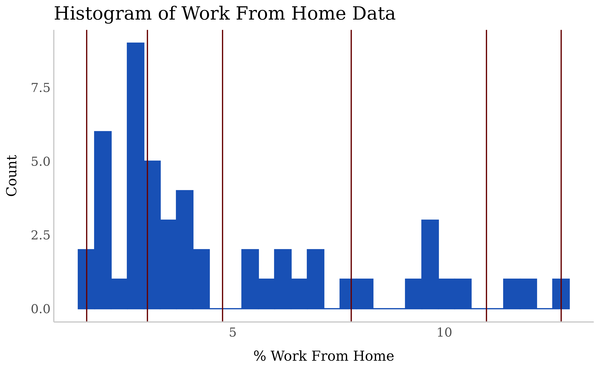

# councilverse

`Councilverse` is a set of packages that work in tandem to help us do
our work quickly, consistently, and seamlessly (like tidyverse but for
the NYCC Data Team). Councilverse currently includes the `councildown`
and `councilcount` packages.

`Councildown` implements NYCC Data Team brand styling defaults for R
Markdown documents, ggplot2 plots, and leaflet maps.

`Councilcount` gives easy access to population data for over 100
demographic groups across NYC’s different geographies.

## Getting Started

### Install Package

``` r
# install the first time
remotes::install_github("newyorkcitycouncil/councilverse",build_vignettes = TRUE)
```

### Load Package

``` r
library(tidyverse)
library(leaflet)
library(ggplot2)
library(sf)
# load councilverse as the last package
# councilverse also loads councildown and councilcount
library(councilverse)
```

### Example Project Using Councilverse, Councildown, and CouncilCount Functions

We will use `councilcount` data in our example of how to make plots and
maps using `councilverse` functions.

``` r
# use councilcount::get_ACS_variables() to check available variables for the 2018-2022 5-Year American Community Survey.
census_vars <- get_ACS_variables("2022")
#> [1] "Printing data dictionary for the 2022 5-Year ACS"
# use councilcount::get_geo_estimates to read in council district data for '% work from home' using 2022 data and 2013 council boundaries
# 'borough', 'communitydist', 'councildist', 'nta', 'policeprct', and 'schooldist' geographies are available, along with citywide numbers (use 'city' as input)
council_geo <- get_geo_estimates(acs_year = "2022", geo = "councildist", var_codes = "DP03_0024E", boundary_year = "2013")  
#> Reading layer `councildist-geographies_b13_2022' from data source 
#>   `/home/runner/work/_temp/Library/councilcount/extdata/councildist-geographies_b13_2022.geojson' 
#>   using driver `GeoJSON'
#> Simple feature collection with 51 features and 637 fields
#> Geometry type: MULTIPOLYGON
#> Dimension:     XY
#> Bounding box:  xmin: 913174.7 ymin: 120124.9 xmax: 1067382 ymax: 272847.3
#> Projected CRS: NAD83 / New York Long Island (ftUS)
```

#### Visualize Data and Determine Map Breaks

``` r
# check distribution of data (basic plot, without councildown)
names(council_geo)[names(council_geo) == 'DP03_0024PE'] <- 'percent_work_from_home_workers_16_and_older'
wfh_hist <- ggplot(data = council_geo, aes(percent_work_from_home_workers_16_and_older)) + geom_histogram(bins = 30)
# use fisher-jenks natural breaks after visualizing data
nat_intvl = classInt::classIntervals(council_geo$percent_work_from_home_workers_16_and_older, n = 5, style = 'fisher')
```

``` r
# visualize breaks using councildown functions and styling
ggplot(data = council_geo, aes(percent_work_from_home_workers_16_and_older)) +
  # use second color from nycc_palette "double" for the histogram bars
  geom_histogram(bins = 30, fill = pal_nycc("double")[2], color = pal_nycc("double")[2]) +
  # use first color from nycc_palette "double" for the breaks
  geom_vline(xintercept = nat_intvl$brks, color = pal_nycc("double")[1]) +
  labs(
    x = "% Work From Home",
    y = "Count",
    title = "Histogram of Work From Home Data",
    color = ""
  ) +
  # use councildown::theme_nycc() for ggplot styling
  theme_nycc() +
  # remove the legend
  theme(legend.position="none")
```



#### Make Palette for Map

``` r
# the function councildown::colorBin has default options for palette, bins, and na.color
pal_council = colorBin(
  # use nycc_blue, which is also the default palette for councildown::colorBin
  palette = "nycc_blue",
  # round to make sure data in the bottom and top bin are not left out
  bins = round(nat_intvl$brks,2),
  domain = council_geo$percent_work_from_home_workers_16_and_older,
  # use the default NA color from councildown::colorBin
  na.color = "#FFFFFF"
)
```

#### Create Map

``` r
# tranform
council_geo <- st_transform(council_geo, crs = 4326)
#build map
map <- leaflet() %>%
  # Use councildown::addCouncilStyle() for leaflet styling
  addCouncilStyle() %>%
  # Use the councildown::addPolygons default smoothFactor and weight
  addPolygons(data = council_geo,
              fillColor = ~pal_council(percent_work_from_home_workers_16_and_older),
              fillOpacity = 1,
              # Use councildown::councilPopup to style popups
              label = ~lapply(councilPopup(
                paste0("<h3>", paste0("CD: ", councildist), "</h3>",
                       "<p>", paste0("Work From Home: ", percent_work_from_home_workers_16_and_older, "%"), "</p>")),
                htmltools::HTML)) %>%
  # Use councildown::addLegend_decreasing to reverse the ordering of the legend
  addLegend_decreasing(position = "topleft", pal = pal_council,
                       title = paste0("% Work From Home"),
                       values = c(0, 1), opacity = 1, decreasing = TRUE,
                       labFormat = labelFormat(suffix = "%"),
                       na.label = "NA") %>%
  # Use councildown::addSourceText to add source text on the bottom right of the map
  addSourceText(lat = -73.75, lon = 40.53, "Source: NYCC Data Team")
```

``` r
map
```

``` r
# can add 2013 or 2023 council district boundaries to the map
map_w_dists <- map %>%
  # use councildown::addCouncilStyle to add the boundaries to the existing map
  addCouncilStyle(add_dists = T, dist_year = "2023") %>%
  
  # use councildown::add_council_basemaps to add background maps
  add_council_basemaps(
    selection = c(1, 2, 3, 4, 5, 6), # DEFAULT: All six selected
    custom_names = c("Light", "Dark", "Streets", "Physical", "Satellite", "Basic"), # DEFAULT: Default names
    control_position = "bottomleft", # DEFAULT: Bottom-left position
    control_collapsed = TRUE # DEFAULT: Collapsed (TRUE)
  )
```

``` r
# note: can access council district shapefiles directly through the package
councildown::nycc_cd_13 # 2013 council district lines
councildown::nycc_cd_23 # 2023 council district lines
```

``` r
map_w_dists
```

#### Save Map

``` r
# save the map as static png 
# use councilverse::file_name_generator to create standardized name for file
map_png <- file_name_generator(description = "council_district_percent_work_from_home", date_year = 2022, file_extension = ".png")
# save the map using councildown::mapshot default zoom, vwidth, vheight, remove_controls
mapshot(map, file = glue::glue("visuals/{map_png}"))

# save the map as html
map_html <- file_name_generator(description = "council_district_percent_work_from_home", date_year = 2022, file_extension = ".html")
# save leaflet html (this function is not a part of councilverse)
htmlwidgets::saveWidget(map, file=glue::glue("visuals/{map_html}"), selfcontained = T)
```

## Reference

- CouncilVerse
- CouncilCount
- CouncilDown

#### Graphs and Tables

[`encodeGraphic()`](https://newyorkcitycouncil.github.io/councilverse/reference/encodeGraphic.md)
– Graphics to raw HTML

[`gt_table()`](https://newyorkcitycouncil.github.io/councilverse/reference/gt_table.md)
– gt table to raw HTML helper function

#### Misc

[`file_name_generator()`](https://newyorkcitycouncil.github.io/councilverse/reference/file_name_generator.md)
– Helper function for creating file names using accepted guidelines

[`unzip_sf()`](https://newyorkcitycouncil.github.io/councilverse/reference/unzip_sf.md)
– Helper function for loading in shapefiles that come zipped

#### Population Estimates

`get_bbl_estimates()` – Generates a dataframe that provides population
estimates at the BBL level. There are also columns for latitude and
longitude, which allow for spatial joins if aggregation to other
geography levels is desired.

`get_ACS_variables()` – Provides information on all of the available ACS
demographic variables that can be accessed via get_geo_estimates() for a
specified survey year.

`get_geo_estimates()` – Creates a dataframe that provides population
estimates for selected demographic variables along chosen geographic
boundaries (e.g. council district, borough, etc.) for a chosen ACS
5-Year survey.

#### Plots

`theme_nycc()` – A `ggplot2` theme that uses Council fonts and style
guidelines to produce plots

`scale_fill_nycc()`, `scale_color_nycc()` – Color and fill scales for
`ggplot2` plots. Used to replace
[`scale_color_discrete()`](https://ggplot2.tidyverse.org/reference/scale_colour_discrete.html),
[`scale_color_continuous()`](https://ggplot2.tidyverse.org/reference/scale_colour_continuous.html),
[`scale_fill_discrete()`](https://ggplot2.tidyverse.org/reference/scale_colour_discrete.html),
and
[`scale_fill_continuous()`](https://ggplot2.tidyverse.org/reference/scale_colour_continuous.html)

#### Colors

`pal_nycc()` – Makes a color palette using Council colors

`nycc_pal()` DEPRECATED. Use `pal_nycc` instead

#### Maps

`addCouncilStyle()` – Adds Council styles including tiles, council
district outlines, and fonts to a `leaflet` map

`addSourceText()` – Adds Council “Source” note in the bottom right of
`leaflet` map

[`addPolygons()`](https://rstudio.github.io/leaflet/reference/map-layers.html)
– The `leaflet` function `addPolygons` with default `smoothFactor` and
`weight`

[`colorBin()`](https://rstudio.github.io/leaflet/reference/colorNumeric.html)
– The `leaflet` function `colorBin` with default `palette`, `bins`,
`na.color`

`councilPopup()` – Basic styling for `leaflet` popups

`mapshot()` – Saves `leaflet` maps as a static png image and defaults
map saves with standardized `width`, `height`, and `zoom`

`addLegend_decreasing()` – The `leaflet` function `addLegend` but with
the option for the highest number to be at the top of the legend

`add_council_basemaps()` – appends standard background map tiles to your
`leaflet` map.

#### Data

`nycc_cd_13` – 2013-2023 NYC Council District sf collection

`nycc_cd_23` – 2023-2033 NYC Council District sf collection

#### Templates

`council_html()` – Render a Council HTML report

`council_pdf()` – Render a Council PDF report

#### Misc

`pretty_date` – Make a pretty date
